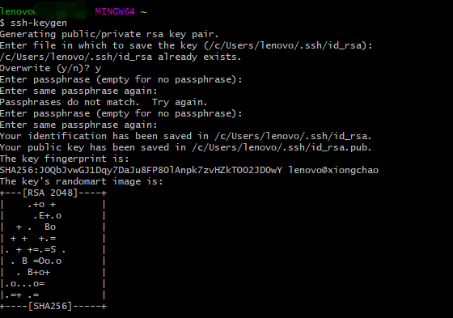

# 使用git工具从github下载上传代码
## 1.github网站账号申请
github官网地址：https://github.com/
==注:== 填写账户民称,邮箱(如8572306518@qq.com)以及密码,如果填写信息消验通过，会给填写的注册邮箱发送账号链接，按照提示完成即可.
## 2.git工具下载
git工具下载地址：https://git-scm.com/downloads
==注:== 根据自己电脑版本,下载相应的版本即可
## 3.git安装
点击下载好的安装文件自动安装，默认一步步安装即可，注意到这个界面的时候选择2。

==鼠标右键点击Git Bash Here,在程序中输入Git指令,出现如下视图，即安装成功==

## 4.git工具配置
##### git config --global user.name "xxx" 设置用户名
##### git config --global user.email "xxx" 设置邮箱

## 5.git工具公钥配置
git工具安装配置完毕,需要把工具的公钥上传到github上.
gitbash环境中,公钥位置:~/.ssh/id_rsa.pub
如果该位置没有公钥,可通过指令生成 ==ssh-keygen==，不用空格

==cat 查看公钥如下:cat ~/.ssh/id_rsa.pub==

将公钥复制粘贴到github中.
登录github网站，点击github网站右上角用户图像，选择settings:

点击Add SSH key按钮完成git工具公钥上传.

因为还未使用该key进行上传代码故图标是黑色的钥匙显示.

## 6.创建github代码仓库
==登录github在界面找到代码仓库列表==

==点击New按钮==

==按照上图描述填写仓库信息即可.
创建仓库完毕，我们可以看到：==

## 7.下载github仓库代码
复制ssh地址：git@github.com:TomcatXiong/Demo.git
会到git 工具，git bash环境，切换到本地代码目录后输入命令：
git clone ssh地址

## 8.文件上传到github代码仓库
###### 创建新仓库的指令：

git init //把这个目录变成Git可以管理的仓库
git add README.md //文件添加到仓库
git add . //不但可以跟单一文件，还可以跟通配符，更可以目      录。一个点就把当前目录下所有未追踪的文件全部add了 
git commit -m "first commit" //把文件提交到仓库　
git remote add origin ==远程仓库地址== //关联远程仓库
git push -u origin master //把本地库的所有内容推送到远程库上

==注：cd进入某盘路径==