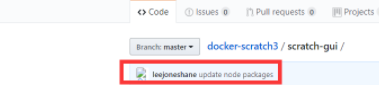
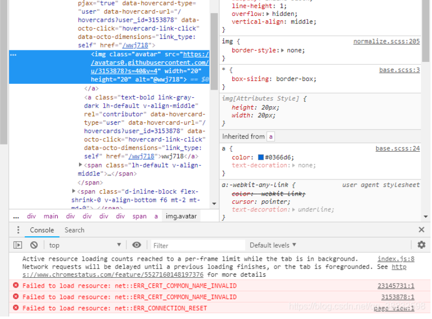
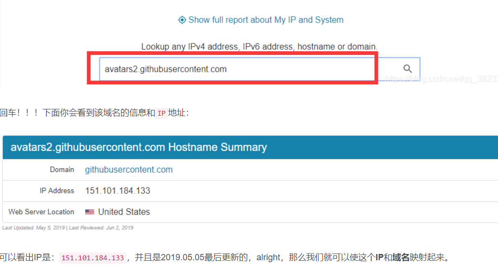
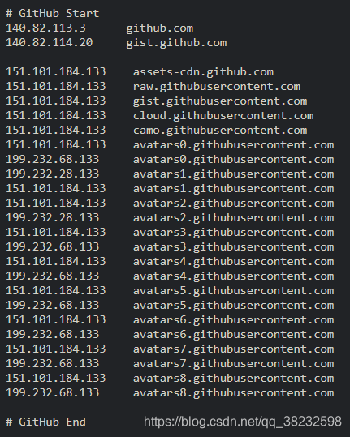

## ==问题==.打开github的任意一张图均不显示，如图

==按F12打开控制台一看究竟==

显示错误提示:==Failed to load resource:net::ERR_CERT_COMMON_NAME_INVALID==
导致这个错误的原因，基本是：
1.dns污染
2.host设置错误
3.官方更新了dns，但是dns缓存没有被更新，导致错误解析

## 解决方法
使用本地hosts文件对网站进行域名解析，一般的DNS问题都可以通过修改hosts文件来解决，github的CDN域名被污染问题也不例外，同样可以通过修改hosts文件解决，将域名解析直接指向IP地址来绕过DNS的解析，以此解决污染问题
==A.找到图片URL路径==
打开github任意未显示图片的网页，使用元素选择器（Ctrl+Shift+C）放在显示不了的图片上，或者在无法显示的图片上右键-检查元素，定位到该图片的标签，那么你得到了它的URL，叫做src属性。

==B.获取IP地址==
得到上述图片网址以后打开[查询网址IP](https://www.ipaddress.com/)这个网站，在搜索框输入它的域名，就是https://到com那一部分，俗称二级域名：avatars2.githubusercontent.com

==C.修改hosts==
找到该文件的位置:==C:\Windows\System32\drivers\etc\hosts==

再次刷新github即可展示图片,若某次再访问github,图片又未显示,那及时更换成最新ip
