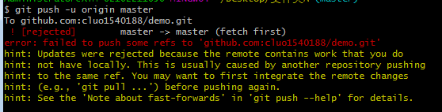

## 上传文件到github上出现的bug
#### A.git拉取github失败，Failed to connect to github.com port 443: Timed out
##### ==git config --global --unset http.proxy==
##### ==git config --global --unset https.proxy==

#### B.Git报错解决：fatal: unable to access ‘https://github.com/…’: OpenSSL SSL_read: Connection was reset, errno 10054

##### ==git config --global http.sslVerify "false"==

## 报错（! [rejected] master -＞ master (fetch first)）解决方案

利用git上传到github已有仓库上去，但是报错! [rejected] master -> master (fetch first)；其报错信息如下：

如上所示，根据提示输入命令无效，报错! [rejected] master -> master (fetch first)；原因是没有什么readme.md文件，其实你自己创建了，再去上传还是错的

正确的解决方法就是将你的仓库和你的github合并了，用填充的方法，即：
> git pull --rebase origin master

输入上述命令，其中origin代表你的仓库uri，后面的master表示将当前的提交到本地仓库的内容和远程仓库合并；
再输入如下命令，即可将本地仓库推送到远程仓库：
>git push -u origin master

其可成功上传：
